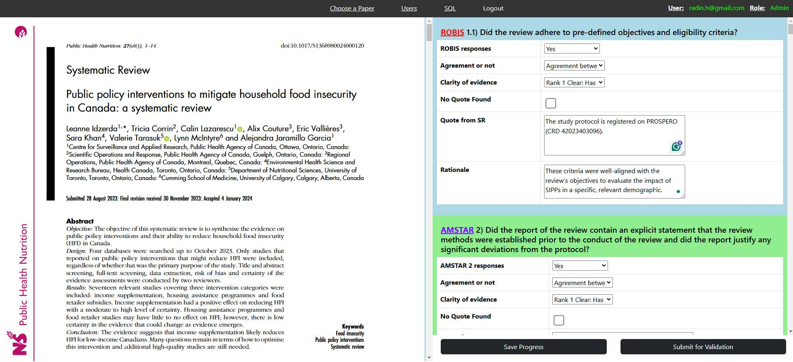

# WISEST Annotation Platform

WISEST (Which Systematic Evidence Synthesis is besT) is an innovative tool designed to streamline the quality assessment of systematic reviews (SRs) using automated deep neural information retrieval techniques. Developed collaboratively by information retrieval specialists and health knowledge synthesis experts, WISEST automates responses to the ROBIS and AMSTAR-2 frameworks, enhancing the consistency and efficiency of SR evaluations.

## Table of Contents
- [Overview](#overview)
- [Features](#features)
- [Installation](#installation)
- [Usage](#usage)
- [System Architecture](#system-architecture)
- [Technologies Used](#technologies-used)
- [Screenshots](#screenshots)
- [Roadmap](#roadmap)
- [FAQ](#faq)
- [Contributing](#contributing)
- [License](#license)
- [Contact](#contact)
- [Changelog](#changelog)
- [Dependencies](#dependencies)

## Overview
The WISEST Annotation Platform reduces the cognitive burden on researchers and health practitioners by automating systematic review quality appraisals. This tool ensures faster, more consistent assessments and supports evidence-based decision-making. It integrates advanced deep learning models to provide automated responses aligned with the ROBIS and AMSTAR-2 frameworks.

## Features
- Automated quality assessment for systematic reviews.
- Integration with ROBIS and AMSTAR-2 for evaluating SRs.
- User-friendly interface for technical and non-technical users.
- Facilitates systematic review annotation and evaluation in an organized manner.
- Open-source for easy customization and further development.

## Installation

### Prerequisites
- **Docker** installed on your machine.
- **Node.js** and **npm** for frontend development.
- **Python 3.x** for backend development.

### Steps
1. **Clone the repository**:

    git clone https://github.com/radinhamidi/WISEST-Annotation-Platform.git
    cd WISEST-Annotation-Platform

2. **Run the app using Docker Compose**:

    docker-compose up --build

3. **Manual setup (if needed)**:
   - Navigate to the `backend/` and `frontend/` directories and follow their `README.md` setup instructions.

## Usage
1. **Start the backend server**:

    cd backend
    python app.py

2. **Start the frontend**:

    cd frontend
    npm start

3. **Access the platform**:
   Open your web browser and go to `http://localhost:3000` to start using the WISEST Annotation Platform.

## System Architecture
The WISEST Annotation Platform is composed of the following components:
- **Frontend**: Built using React for an interactive and user-friendly interface.
- **Backend**: Implemented in Python with Flask to handle data processing, annotations, and API requests.
- **Database**: PostgreSQL is used to store user data and systematic review annotations.

## Technologies Used
- **Frontend**: React, HTML, CSS, JavaScript
- **Backend**: Python, Flask
- **Database**: PostgreSQL
- **Deployment**: Docker, Docker Compose
- **Data Processing**: Pandas, NumPy

## Screenshots
Here is an example of the WISEST Annotation Platform interface:

## Roadmap
- [ ] Enhance multi-language support.
- [ ] Implement user authentication and role management.
- [ ] Improve annotation export options.
- [ ] Integrate additional AI models for comprehensive quality assessments.

## FAQ
**Q: How do I contribute to this project?**  
A: Follow the guidelines in the [Contributing](#contributing) section.

**Q: What frameworks are required to run this project?**  
A: Docker, Node.js, npm, and Python 3.x are needed.

## Contributing
Pull requests are welcome. For major changes, please open an issue first to discuss what you would like to change.

### Steps to Contribute:
1. Fork the repository.
2. Create a new branch (`git checkout -b feature/YourFeature`).
3. Commit your changes (`git commit -m 'Add a new feature'`).
4. Push to the branch (`git push origin feature/YourFeature`).
5. Open a pull request.

## License
This project is licensed under the MIT License. See the [LICENSE](LICENSE) file for details.

## Contact
For any questions or issues, please reach out via [GitHub Issues](https://github.com/radinhamidi/WISEST-Annotation-Platform/issues).

## Changelog
See the [CHANGELOG](CHANGELOG.md) for details on version updates and changes.

## Dependencies
- **Python**: 3.x
- **Flask**: x.x.x
- **React**: x.x.x
- **Docker**: x.x.x
